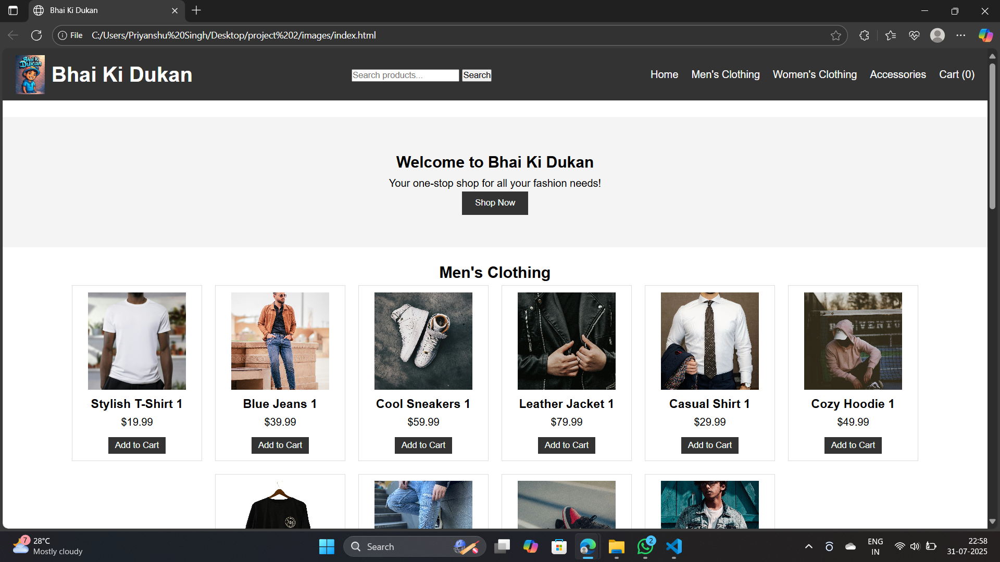

## 🛍️ Bhai Ki Dukan

**Bhai Ki Dukan** is a stylish, responsive e-commerce website template for selling clothing and accessories. It features product listings for men, women, and accessories, a shopping cart system, and a built-in product search function. The site is built using **HTML**, **CSS**, and **JavaScript**, and is designed for easy customization and extension.

### ✨ Features

* 🧥 Dynamic product catalog for different categories
* 🛒 Shopping cart with item count and modal view
* 🔍 Product search with support for Enter key
* 🎨 Clean, responsive design with header banner and navigation

### 🚀 Future Improvements / Features

* 🔐 **User Authentication**
  Allow users to sign up, log in, and manage their profiles.

* 💳 **Payment Integration**
  Integrate real payment gateways (e.g., Razorpay, Stripe) for real checkout functionality.

* 📦 **Product Details Page**
  Add individual pages for each product with descriptions, sizes, reviews, etc.

* 🛍️ **Persistent Cart (LocalStorage)**
  Save cart data in localStorage so it’s not lost on page refresh.

* 🗂️ **Category Filters and Sorting**
  Filter products by price, rating, and category. Add sorting options like “Low to High”.

* 🌐 **Responsive Design Enhancements**
  Improve mobile navigation and layout for smaller screens.

* 🔎 **Live Search / Autocomplete**
  Implement real-time search suggestions as the user types.

* 🧾 **Order Summary & Checkout Flow**
  Create a complete checkout experience with order summary and confirmation.

* 📊 **Admin Dashboard**
  Add an admin panel to manage products, view orders, and analyze stats.

  

